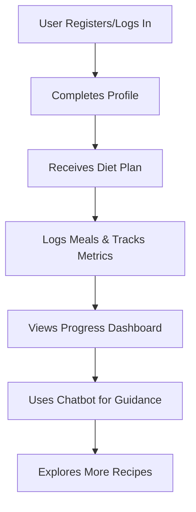

# DieticianDidi

## Introduction

DieticianDidi is an innovative platform designed to provide personalized diet and nutrition advice. Built to cater to users looking to improve their eating habits, manage health conditions, or achieve specific health goals, the application leverages modern web technologies and intelligent algorithms. DieticianDidi aims to simplify the journey toward a healthier lifestyle by delivering tailored meal plans, tracking user progress, and offering expert nutritional guidance.

## Features

- **Personalized Diet Plans**  
  Users receive meal recommendations based on their health profiles, dietary preferences, and fitness goals.

- **Interactive Chatbot**  
  An integrated chatbot assists users by answering diet-related queries and offering instant guidance.

- **Health Metrics Tracking**  
  Users can log food intake, monitor calories, and track macronutrients for improved accountability.

- **User Authentication**  
  Secure registration and login ensure privacy and protect user data.

- **Recipe Suggestions**  
  The platform offers healthy recipes that fit individual dietary restrictions and preferences.

- **Progress Dashboard**  
  Users can visualize their journey with charts and summary statistics.

- **Admin Panel**  
  Administrators can manage users, content, and monitor system health.

## Installation

Follow these steps to set up DieticianDidi locally:

1. **Clone the Repository**
   ```bash
   git clone https://github.com/JaiswalRajatj/DieticianDidi.git
   cd DieticianDidi
   ```

2. **Install Dependencies**
   ```bash
   npm install
   ```
   or, if you are using Yarn:
   ```bash
   yarn install
   ```

3. **Setup Environment Variables**
   - Copy the example environment file and edit it with your configuration.
   ```bash
   cp .env.example .env
   ```
   - Update database URI, API keys, and other secrets in `.env`.

4. **Run Database Migrations**  
   Ensure your database is running and apply any migrations (if applicable):
   ```bash
   npm run migrate
   ```

5. **Start the Development Server**
   ```bash
   npm start
   ```
   The app will be available at `http://localhost:3000`.

## Usage

Once installed, you can start using DieticianDidi by registering as a new user or logging in with existing credentials.

- **Register / Login:**  
  Access the registration or login page to create an account or sign in.
  
- **Set Up Profile:**  
  Enter basic information such as age, weight, height, activity level, and dietary preferences.

- **Explore the Dashboard:**  
  Use the dashboard to view your daily meal plan, track nutrition, and log meals.

- **Interact with the Chatbot:**  
  Ask questions or get instant advice using the integrated chatbot.

- **Browse Recipes:**  
  Explore healthy recipes tailored to your goals.

- **Monitor Progress:**  
  Check your progress in the dashboard with visualizations and reports.

- **Admin Controls:**  
  (For admin users) Access the admin panel to manage users and application data.

### Example User Flow



## Contributing

We welcome contributions to DieticianDidi! To contribute, follow these guidelines:

- **Fork the Repository**  
  Create your own fork and clone it locally.

- **Create a Feature Branch**  
  Make a branch for your feature or bugfix.
  ```bash
  git checkout -b feature/your-feature
  ```

- **Make Changes & Test**  
  Implement your changes and test thoroughly.

- **Commit and Push**  
  Commit with clear messages and push your branch.
  ```bash
  git add .
  git commit -m "Add: your descriptive message"
  git push origin feature/your-feature
  ```

- **Create a Pull Request**  
  Open a pull request on GitHub detailing your changes.

- **Code Review**  
  Collaborate with maintainers for any required changes.

- **Stay Updated**  
  Regularly sync with the main branch to avoid conflicts.

### Contribution Guidelines

- Follow the existing code style and architecture.
- Write clear, descriptive commit messages.
- Add comments and documentation where necessary.
- Include tests for new features or bugfixes.
- Be respectful and constructive in code reviews.

---

Thank you for contributing to DieticianDidi and helping to make healthy living accessible for everyone!
